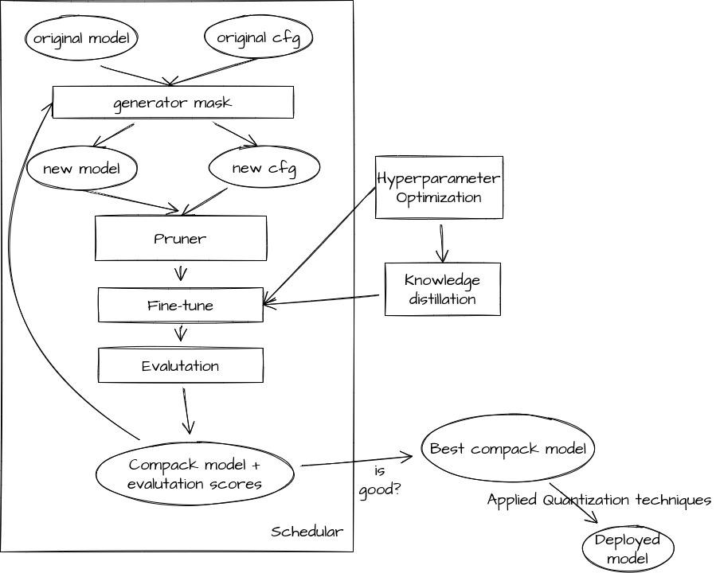

# A Pytorch Optimization library for benchmarking and extending works in the domains of Knowledge Distillation, Pruning, and Quantization.


## Supported Features

### **Pruning** (Not support Conv3d)

- AGP Pruner (L-norm, APoZ)
- Slim Pruner (ChannlePruner, FilterPruner, GroupPruner, ...)
- FPGM Pruner
- ADMM Pruner
- Sensitivity Prunner

### **Quantization** 

- Support PQT, QAT, DorefaQuantization, v.v

### **Knowledge Distillation**

Easy traning with student, teacher.
- Add example apply KD for training pruned model.
- Add reviewKD [Distilling Knowledge via Knowledge Review](https://arxiv.org/pdf/2104.09044.pdf)


## How to use:

```python
pip install -r requirments.txt
```

- **Document**: Comming soon!!!!!

- Get infomation: [Link](https://vinbrain.atlassian.net/wiki/spaces/AS/pages/1935671422/Document+for+Optimization+Toolkit)
## Roadmap
 - [x] Add pruning method for Transformer, RNN.
 - [x] Add quantization method.
 - [x] Add more loss function in Knowledge Distillation method.
 - [ ] Add Spatial SVD method: Tensor decomposition technique to split a large layer in two smaller ones.
 - [ ] Add visualization in tensorboard.

